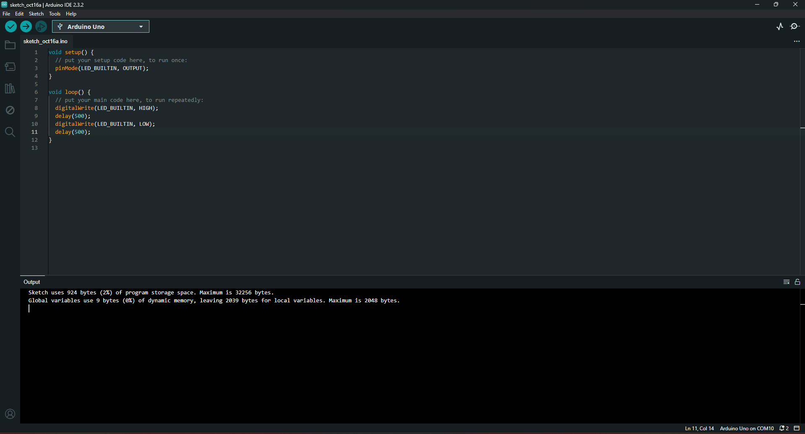

# Ponderada Lucas Periquito

### Video Do Blink

&emsp; Verificar arquivo VID_20241016_081938090.mp4

<br>

### Print do Código


```ino
void setup() {
  // put your setup code here, to run once:
  pinMode(LED_BUILTIN, OUTPUT);
}

void loop() {
  // put your main code here, to run repeatedly:
  digitalWrite(LED_BUILTIN, HIGH);
  delay(500);
  digitalWrite(LED_BUILTIN, LOW);
  delay(500);
}
```